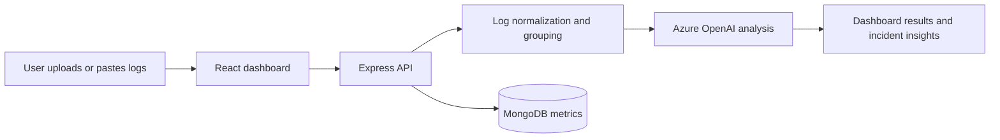
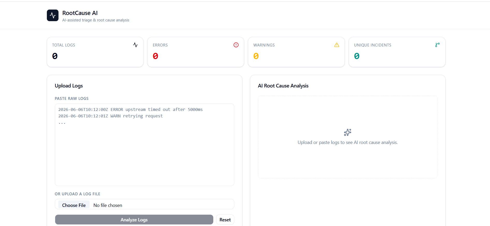

# RootCause AI

RootCause AI is an AI-assisted log triage and root cause analysis platform that helps teams turn noisy operational logs into actionable incident insights. Users can paste log text, upload log files, and receive structured analysis including summary, severity, suggested remediation, and incident frequency.

Application Web Link : https://rootcauseai-dusky.vercel.app/

## Features

- Upload log files or paste log content directly into the interface
- Normalize raw log lines into a consistent structure with timestamp, level, source, and message
- Group related incidents to reduce duplicate noise
- Use Azure OpenAI to generate concise summaries, severity ratings, and remediation guidance
- View results in a dashboard with metrics and incident details
- Persist analysis metrics in MongoDB for later review

## Tech Stack

- Frontend: React, TypeScript, Vite, Tailwind CSS, shadcn/ui
- Backend: Node.js, Express, TypeScript
- AI: Azure OpenAI via the OpenAI SDK
- Data: MongoDB
- File handling: Multer
- Deployment Frontend: Vercel
- Deployment Backend: Railway

## Architecture

The application follows a simple three-layer flow:



### How it works

1. The client sends log input to the backend.
2. The server normalizes the logs and groups repeated incidents.
3. Azure OpenAI analyzes the grouped content and returns structured output.
4. The dashboard displays the analysis and incident breakdown.

## Project Structure

```text
project-root/
├── client/                # React + Vite frontend
├── server/                # Express + TypeScript backend
├── README.md
└── project.md             # Project notes and planning
```

## Look and Feel



## Prerequisites

- Node.js 18 or newer
- npm
- An Azure OpenAI resource and deployment
- A MongoDB instance such as MongoDB Atlas

## Installation

### 1. Clone the repository

```bash
git clone <your-repo-url>
cd "MSFT Build AI"
```

### 2. Install frontend dependencies

```bash
cd client
npm install
```

### 3. Install backend dependencies

```bash
cd ../server
npm install
```

### 4. Configure environment variables

Create a `.env` file in the server directory with the following values:

```env
PORT=8001
AZURE_OPENAI_ENDPOINT=https://<your-resource>.openai.azure.com/
AZURE_OPENAI_API_KEY=<your-api-key>
AZURE_DEPLOYMENT_NAME=<your-model-deployment>
MONGODB_URI=mongodb://localhost:27017/rootcauseai
```

If you want to point the frontend at a different backend URL, update [client/src/services/config.ts](client/src/services/config.ts).

### 5. Start the development servers

Run the backend:

```bash
cd server
npm run dev
```

Run the frontend in a second terminal:

```bash
cd client
npm run dev
```

The frontend will be available at the Vite local address and the backend at `http://localhost:8001`.

## API Endpoints

### Health check

- GET `/health`
- Returns: `Server running`

### Analyze logs

- POST `/logs/analyze`
- Request body:

```json
{
  "logs": "ERROR: Database connection timed out"
}
```

- Response:

```json
{
  "summary": "Database connection timeouts are occurring intermittently",
  "severity": "high",
  "suggestedFix": "Check database connectivity and retry logic",
  "frequency": 3
}
```

### Upload a log file

- POST `/logs/upload`
- Accepts a multipart form upload with the field `upload_file`
- Returns uploaded file metadata and file contents

### Save metrics

- POST `/logs/savemetrics`
- Stores analysis-related metrics in MongoDB

## Screenshots

Screenshots will be added here as the UI evolves. Planned visuals include:

- The main dashboard with incident metrics
- The log upload and analysis workflow
- The AI-generated root cause result card

## Future Improvements

- Integrate with Azure Monitor, CloudWatch, and other observability platforms
- Add authentication and role-based access control
- Improve incident deduplication and clustering accuracy
- Add persistent history and report export
- Introduce batch processing for large log volumes


